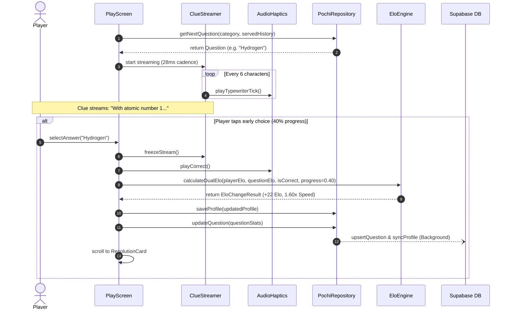

# PochiPochi (ポチポチ) — Core Concepts & Architecture Specification

> **A comprehensive deep-dive into the architectural principles, gameplay mechanics, mathematical engines, design systems, and data pipelines powering PochiPochi.**

---

## Table of Contents

1. [Executive Vision & Design Philosophy](#1-executive-vision--design-philosophy)
2. [Sequential Clue Streaming Engine](#2-sequential-clue-streaming-engine)
3. [Dynamic Speed Bonus Economics](#3-dynamic-speed-bonus-economics)
4. [Answer Mask & Progressive Scaffolding](#4-answer-mask--progressive-scaffolding)
5. [Dual-Sided Dynamic Elo Rating Engine](#5-dual-sided-dynamic-elo-rating-engine)
6. [Trivia Data Pipeline & Adaptive Matchmaking](#6-trivia-data-pipeline--adaptive-matchmaking)
7. [First-Time User Experience (FTUE) & Placement Pipeline](#7-first-time-user-experience-ftue--placement-pipeline)
8. [Authentication & Identity Architecture](#8-authentication--identity-architecture)
9. [Offline-First Data Layer & Repository Pattern](#9-offline-first-data-layer--repository-pattern)
10. [Audio & Haptics Lifecycle Architecture](#10-audio--haptics-lifecycle-architecture)
11. [Visual Language & Design System](#11-visual-language--design-system)
12. [System Architecture & Component Map](#12-system-architecture--component-map)

---

## 1. Executive Vision & Design Philosophy

### 1.1 The Japanese "早押しクイズ" (Haya-Oshi Quiz) Heritage
Traditional mobile trivia games present players with a static block of text, a countdown timer, and four buttons. This paradigm rewards passive reading and memorization, often boiling down to who can read a 50-word paragraph the quickest or guess between two remaining choices.

**PochiPochi (ポチポチ)** reinvents this experience through the lens of Japanese quiz show buzzer culture:
- **"Pochi" (ポチ)** represents the satisfying onomatopoeia of pressing a spring-loaded physical buzzer button down.
- **Haya-Oshi (早押し)** is the art of interrupting a clue the millisecond you recognize the underlying answer—often before the reader has finished pronouncing the key nouns.

In PochiPochi, knowledge is not merely binary (knowing vs. not knowing); it is a continuous spectrum of **confidence under incomplete information**.

```
Traditional Trivia:
[ Read Full Question (100% Info) ] ──> [ Static 10s Timer ] ──> [ Tap Option ]

PochiPochi Rapid Progressive Trivia:
[ Clue Streams Letter-by-Letter ] ────> [ Interrupt Early (10%-40% Info) ] ──> [ Up to 2.0x Speed Bonus ]
                                  └───> [ Wait for Context (80%-100% Info) ] ──> [ Base 1.0x Multiplier ]
```

### 1.2 The "Café Tactile" Aesthetic
Unlike typical neon-soaked gamified trivia apps or sterile flat-design quiz clones, PochiPochi adopts a warm, tactile **Editorial Café** aesthetic:
- **Tactile Paper Surfaces**: High-contrast, warm canvas backgrounds (`#F8F5EE` Fair Bianca) that evoke reading a premium broadsheet newspaper in a quiet café.
- **Physical Elevation & Micro-Presses**: Interactive elements possess physical weight—crisp borders (`#E2DDD2`), downward translate shifts on tap (`translateY: 1-2px`), and subtle elevation shadows.
- **Zero Generic Emojis**: Every visual indicator is rendered with precision SVG vectors, Lucide icons, or custom-drawn line-art characters.
- **Living Mascot Companion**: Pochi the Labrador and fellow companions actively react to game state with expressive, charming vector line-art expressions (`happy`, `pensive`, `excited`, `confused`).

---

## 2. Sequential Clue Streaming Engine

### 2.1 Character-by-Character Stream Cadence
At the heart of the gameplay is `ClueStreamer` (`src/components/game/ClueStreamer.tsx`). Clues do not populate all at once. Instead, they stream sequentially character-by-character:

- **28ms Per-Letter Cadence**: Calibrated to match the upper bound of comfortable reading speed (~35 characters per second), creating a brisk, rhythmic flow that commands active focus.
- **Auditory Typewriter Feedback**: A subtle synthesized audio tick fires every 6 characters, establishing an auditory cadence that heightens cognitive immersion.
- **No Ghost Text / Zero Placeholder Length**: Unlike word puzzles that reveal grayed-out silhouette text, future characters remain strictly invisible. Players cannot infer the clue length or word boundaries ahead of the streaming cursor.
- **Pulsing Tension Aura**: While a question is actively streaming, the question container breathes with a subtle sine-wave pulsation (scale: `1.00` to `1.02`, glow opacity: `0.0` to `0.45` over 900ms), signaling that time and potential speed bonuses are actively burning.

### 2.2 Instant Freeze & Resolution
The streaming interval is governed by strict lifecycle guarantees:
1. **Answer Selection Freeze**: Selecting any of the 4 multiple-choice options immediately stops the timer, freezes the progress ratio at that exact millisecond, and expands the clue to 100% revealed text.
2. **Tab Switch Safety**: If the player switches tabs or navigates away mid-stream, `useFocusEffect` silences all ticks, halts interval timers, and suspends audio context.

---

## 3. Dynamic Speed Bonus Economics

### 3.1 Mathematical Decay Formula
PochiPochi rewards players who take calculated risks with incomplete information. As the clue streams, a **Speed Bonus Multiplier** decays continuously from **2.00x** down to a floor of **1.00x**.

The multiplier is computed in `src/engine/eloEngine.ts` via:

$$\text{Multiplier}(p) = \text{clamp}\left(1.00,\, 2.00,\, 2.00 - 1.00 \times p\right)$$

Where $p \in [0.0, 1.0]$ represents the clue reveal progress ratio:

$$p = \frac{\text{revealedCharacters}}{\text{totalCharacters}}$$

```
Multiplier
  2.00x ┌───────────\
        │            \
  1.75x │             \
        │              \
  1.50x │               \
        │                \
  1.25x │                 \
        │                  \
  1.00x │                   \────────────────────────
        └──────────────────────────────────────────── Clue Progress (p)
        0.00   0.20   0.40   0.60   0.80   1.00
       [Start]      [First Hint]   [Last Hint]   [Full Text]
```

### 3.2 Asymmetric Stakes Philosophy
The scoring and rating economy is intentionally designed to encourage brave early interruptions rather than punitive play:
- **Correct Early Answer**: The player receives the full speed multiplier applied to their Elo score gain:
  $$\Delta R_{\text{Player}} = \text{round}\left(K_{\text{base}} \times M_{\text{speed}} \times (1 - E_{\text{Player}})\right)$$
  An early interrupt at 15% progress ($M \approx 1.85\text{x}$) nearly doubles the Elo reward.
- **Incorrect Answer**: The speed multiplier **does not** amplify the penalty. The player loses standard Elo:
  $$\Delta R_{\text{Player}} = \text{round}\left(K_{\text{base}} \times (0 - E_{\text{Player}})\right)$$
  This asymmetry ensures that players feel empowered to test their instincts rather than waiting defensively for the entire sentence to conclude.

---

## 4. Answer Mask & Progressive Scaffolding

### 4.1 Structural Letter Slots (`AnswerMask`)
Positioned prominently above the clue streamer, the `AnswerMask` (`src/components/game/AnswerMask.tsx`) displays the anatomical structure of the target answer:
- Word boundaries and letter slots are rendered as distinct physical tiles (e.g., `[ _ ][ _ ][ _ ][ _ ]   [ _ ][ _ ][ _ ]`).
- A clean monospace letter-count tag (e.g., `7 LETTERS`) provides an anchor for rapid deduction.

### 4.2 Progressive Threshold Reveals
As the clue streams, the system automatically reveals tactical letter hints at designated milestones:

| Clue Progress | Reveal Condition | Visual Effect |
| :--- | :--- | :--- |
| **0% – 39%** | Initial state | All letters hidden (`_`) |
| **40%** | Answer length $> 3$ letters | First letter automatically unlocks in slot (e.g., `[ T ][ _ ][ _ ][ _ ]`) |
| **75%** | Answer length $> 5$ letters | Last letter automatically unlocks in slot (e.g., `[ T ][ _ ][ _ ][ O ]`) |
| **Answered** | User selects choice | Full target answer unmasked in bold royal blue typography |

*Note: Players who prefer hardcore Jeopardy!-style play can disable letter count hints at any time via the in-game Options Menu.*

---

## 5. Dual-Sided Dynamic Elo Rating Engine

### 5.1 The Question as an Opponent
In standard gaming systems (like chess), Elo calculates rating deltas between two human players. In PochiPochi, **the Question is treated as an active, living opponent with its own persistent Elo rating**.

Every question has an Elo rating calibrated between **800 and 1800+**:
- When a player answers correctly, the player wins: the player's Elo rises, and the question's Elo drops (marking it as easier).
- When a player misses, the question wins: the player's Elo drops, and the question's Elo rises (marking it as harder).

Over thousands of games, questions naturally settle into their true empirical difficulty without requiring manual editorial re-calibration.

```
       [ Player Elo: 1250 ]  <─── Dynamic Matchup ───>  [ Question Elo: 1200 ]
                                          │
                     ┌────────────────────┴────────────────────┐
                     ▼                                         ▼
            [ Player Answers CORRECT ]                [ Player Answers INCORRECT ]
          Player Elo: +19 (1.80x Speed)             Player Elo: -16 (Base Penalty)
          Question Elo: -19                         Question Elo: +16
```

### 5.2 Mathematical Formulation
The Elo engine (`src/engine/eloEngine.ts`) evaluates expected performance using the standard logistic distribution curve:

$$E_{\text{Player}} = \frac{1}{1 + 10^{(R_{\text{Question}} - R_{\text{Player}}) / 400}}$$

$$E_{\text{Question}} = 1 - E_{\text{Player}}$$

The actual outcome $S$ is binary:
- Player wins: $S_{\text{Player}} = 1$, $S_{\text{Question}} = 0$
- Question wins: $S_{\text{Player}} = 0$, $S_{\text{Question}} = 1$

The dynamic $K$-factor incorporates the player's speed multiplier:

$$K_{\text{effective}} = K_{\text{base}} \times M_{\text{speed}} \quad (\text{where } K_{\text{base}} = 32)$$

The raw score adjustments:

$$\Delta R_{\text{Player}} = \text{round}\left(K_{\text{effective}} \times (S_{\text{Player}} - E_{\text{Player}})\right)$$

$$\Delta R_{\text{Question}} = \text{round}\left(K_{\text{effective}} \times (S_{\text{Question}} - E_{\text{Question}})\right)$$

*(A minimum change of $\pm 1$ is enforced whenever a discrepancy exists, preventing stagnant zero-sum outcomes).*

### 5.3 Multi-Dimensional Elo Tracking
Players maintain both a global macro rating and discrete category proficiencies:
- **Overall Elo**: The harmonic composite rating across all four domains.
- **Category Elos**: Independent ratings for **Science**, **Geography**, **Anime & Manga**, and **General Knowledge**. A player can be a Grandmaster in Anime (1850 Elo) while simultaneously developing as a Curious Novice in Science (1120 Elo).

### 5.4 Rank Tiers & Companion Archetypes
Elo ratings are grouped into five official competitive divisions, each championed by a distinct mascot archetype:

| Division Tier | Elo Range | Emblem Mascot | Theme Color | Psychological Descriptor |
| :--- | :--- | :--- | :--- | :--- |
| **Grandmaster Owl** | $\ge 2000$ | Professor Owl | `#00009F` Deep Royal | Deep scholarly mastery and razor-sharp deduction |
| **Trivia Master Cat** | $1700 - 1999$ | Trivia Cat Neko | `#7C3AED` Purple | Feline agility, lightning reflexes, and broad lore |
| **Scholar Bear** | $1500 - 1699$ | Globe Trotter Bear | `#059669` Emerald | Consistent, steady analytical reasoning |
| **Smart Pup** | $1300 - 1499$ | Pochi Labrador | `#E08722` Burnt Ochre | Enthusiastic, fast learner with rising instincts |
| **Curious Novice** | $< 1300$ | Beginner Sprout | `#64748B` Slate | Eager explorer discovering the competitive arena |

---

## 6. Trivia Data Pipeline & Adaptive Matchmaking

### 6.1 Jeopardy! Archive Elo Calibration
PochiPochi integrates clues derived from the historic J! Archive (spanning 40+ seasons of Jeopardy! television matches). Dollar tiers are mathematically translated into baseline question Elo ratings:

```
Jeopardy! Round:
  $200  ──>  1050 Elo  (Accessible, foundational knowledge)
  $400  ──>  1150 Elo
  $600  ──>  1250 Elo
  $800  ──>  1350 Elo
  $1000 ──>  1450 Elo  (Deep category specificity)

Double Jeopardy! Round:
  $400  ──>  1200 Elo
  $800  ──>  1300 Elo
  $1200 ──>  1400 Elo
  $1600 ──>  1500 Elo
  $2000 ──>  1600 Elo  (Elite, tournament-level discrimination)
```

### 6.2 Adaptive Matchmaking Algorithm
When a player requests a new question in `PochiRepository.getNextQuestion()`, the system pairs them with questions calibrated to their current skill level:

1. **Category Filter**: The candidate pool is filtered by the chosen category (or all categories in Endless Mode).
2. **Introductory Priority Ramp**: If a player has not yet completed the 3-question introductory sequence for that category, those placement clues (`extremely_easy` $\to$ `very_easy` $\to$ `medium`) are served in priority order.
3. **Elo Delta Sorting**: All remaining unserved candidates are sorted by the absolute difference from the player's target category Elo:
   $$\Delta \text{Elo} = |R_{\text{Question}} - R_{\text{Player}}|$$
4. **Randomized Top-K Selection**: To prevent deterministic question repetition, the engine randomly picks from the top 3 closest Elo matches:
   $$\text{Selected} \in \text{TopChoices}[0..2]$$
5. **Session Deduplication Guard**: The engine maintains a memory set of both question UUIDs and normalized clue text (`clue_text.trim().toLowerCase()`). No question can be repeated during an active play session.
6. **Dynamic Prefetching**: When the local candidate pool drops below 25 questions, the repository automatically fires a background query to Supabase using a randomized offset across the 1,000+ database rows (`offset: 0..950`), guaranteeing variety without network stalls.

### 6.3 Post-Question Resolution Card
Following every answer, the viewport smoothly scrolls to the `ResolutionCard` (`src/components/game/ResolutionCard.tsx`):
- **Outcome Banner**: Clear emerald checkmark or crimson miss badge.
- **Elo Delta Badge**: Exact points gained or lost, featuring the speed bonus tag (e.g., `+18 Elo (1.92x Speed)`).
- **Curated Context Summary**: 2–3 sentences explaining the historical, scientific, or cultural context behind the clue.
- **Wikipedia Deep Link**: One-tap native browser integration opening the verified article directly via `expo-web-browser`.
- **Notebook Bookmark**: Instant persistence to the offline Knowledge Notebook.
- **Question Flagging**: Community reporting modal (`factual inaccuracy`, `typo/grammar`, `mask error`, `offensive content`).

---

## 7. First-Time User Experience (FTUE) & Placement Pipeline

Rather than throwing newcomers directly into cold trivia lists or forcing an upfront registration form, PochiPochi implements an engaging, 6-stage interactive onboarding pipeline (`app/ftue.tsx`):

```
┌─────────────────────────────────────────────────────────────────────────┐
│                    6-STEP FTUE ONBOARDING FUNNEL                        │
└─────────────────────────────────────────────────────────────────────────┘
  [ Step 1: The Tactile Hook ]
       │  3D squash-and-stretch Pochi buzzer press with heavy haptics & pop
       ▼
  [ Step 2: Companion Archetype Pick ]
       │  Select avatar: Pochi (Dog), Trotter (Bear), Otaku (Bunny), Owl (Professor)
       ▼
  [ Step 3: Category Gateway ]
       │  Pick initial affinity domain: Science, Geography, Anime, or General
       ▼
  [ Step 4: 3-Question Micro-Calibration Arena ]
       │  Live progressive streaming with introductory tiers:
       │  Q1: Extremely Easy  (Pikachu, Gold, Tokyo, Mona Lisa)
       │  Q2: Very Easy       (Naruto, Penicillin, Amazon, Pyramids)
       │  Q3: Medium          (Spirited Away, Jupiter, Everest, Shakespeare)
       ▼
  [ Step 5: Diagnostic Elo & Streak Reveal ]
       │  Roll-up counter animation (1000 ──> 1260 Elo) + Flame streak ignite
       │  Interactive accordion review with Wikipedia summaries
       ▼
  [ Step 6: Value-Lock Gate ]
          Lock in stats via Google OAuth, Apple Sign-In, or Guest Mode
```

### 7.1 Diagnostic Calibration Formula
Upon completing the three calibration questions, the player's initial baseline Elo is calculated:
- **3 of 3 Correct**: Calibrated to **1260 Elo** (Fast-track to Smart Pup tier).
- **2 of 3 Correct**: Calibrated to **1230 Elo** (Above-average baseline).
- **1 of 3 Correct**: Calibrated to **1180 Elo** (Solid foundational baseline).
- **0 of 3 Correct**: Calibrated to **1140 Elo** (Curious Novice start with gentle onboarding curve).

### 7.2 The Value-Lock Conversion
By deferring authentication until **after** the player has experienced the tactile buzzer, completed 3 thrilling rapid clues, and witnessed their newly earned diagnostic Elo roll up to 1260+, conversion rates increase dramatically. Players are not signing up for an unknown app; they are **securing hard-won Elo points, an active streak, and their saved companion**.

---

## 8. Authentication & Identity Architecture

### 8.1 Dual-Strategy Web & Native OAuth (`GoogleAuthService`)
Native OAuth in mobile apps often suffers from redirect failures, white-screen browser hangs, or configuration mismatch between web popups and native URI schemes. PochiPochi solves this with a robust dual-strategy architecture (`src/services/auth/googleAuth.ts`):

```
                       ┌─────────────────────────┐
                       │  User Taps "Google"     │
                       └────────────┬────────────┘
                                    │
                    ┌───────────────┴───────────────┐
                    ▼                               ▼
            [ Web Platform ]                [ Native Platform ]
        WebBrowser.openAuthSession      WebBrowser.openAuthSessionAsync
          + /auth/callback redirect       + Concurrent Deep Link Listener
                    │                               │
            Popup Redirects back            Expo Go: exp://localhost:8081
                    │                       Standalone: pochipochi://
                    ▼                               │
        Exchange Token/Code for Session ◄───────────┘
                    │
                    ▼
       Sync Profile & Transition to Tabs
```

1. **Web Environment**: Uses `WebBrowser.openAuthSessionAsync` targeting the whitelisted `${origin}/auth/callback` path.
2. **Native Environment (Expo Go & Standalone Build)**:
   - Evaluates execution environment: Uses `exp://localhost:8081/--/auth/callback` for Expo Go (registered with `host.exp.exponent`) and `pochipochi://auth/callback` for standalone builds.
   - Pairs `WebBrowser.openAuthSessionAsync` with a concurrent `Linking.addEventListener('url')` listener to immediately capture both token fragments (`#access_token=...&refresh_token=...`) and authorization codes (`?code=...`).
   - Prevents blank-screen hangs in Chrome Custom Tabs on Android by avoiding unwhitelisted dynamic LAN IPs that cause Supabase to reject redirects.
   - Provides immediate, non-blocking fallbacks (Demo Google login and Play as Guest) if dismissed or interrupted.
3. **Guest Mode**: Zero-friction play option creating a persistent local guest UUID (`guest-${Date.now()}`) that can be seamlessly upgraded to cloud sync at any future point.

---

## 9. Offline-First Data Layer & Repository Pattern

### 9.1 Unified Repository Pattern (`PochiRepository`)
The application implements a strict Repository Pattern (`src/data/repository.ts`) that decouples UI views from underlying storage mechanisms. All reads and writes flow through `PochiRepository`.

```
┌────────────────────────────────────────────────────────────────────────┐
│                        UI Screens & Components                         │
│             (PlayScreen, HomeScreen, Bookmarks, FTUE)                  │
└───────────────────────────────────┬────────────────────────────────────┘
                                    │
                                    ▼
┌────────────────────────────────────────────────────────────────────────┐
│                      PochiRepository (Façade)                          │
│   - Memory Cache (questionsCache, profileCache, bookmarksCache)        │
│   - Deduplication & Candidate Filtering                               │
│   - Asynchronous Background Sync Scheduler                            │
└──────────────────┬──────────────────────────────────┬──────────────────┘
                   │                                  │
                   ▼                                  ▼
      ┌─────────────────────────┐        ┌─────────────────────────┐
      │   AsyncStorage (Local)  │        │   Supabase Client (DB)  │
      │   - Offline profiles    │        │   - 1,000+ Question DB  │
      │   - Cached clues        │        │   - Global Leaderboard  │
      │   - Bookmarks & Reports │        │   - Two-way Cloud Sync  │
      └─────────────────────────┘        └─────────────────────────┘
```

### 9.2 In-Memory Hot Caching
To maintain 60 FPS transitions between tabs, `PochiRepository` holds synchronous memory caches (`profileCache`, `questionsCache`, `bookmarksCache`). Disk reads against `AsyncStorage` occur once on initialization; subsequent calls return instantaneously.

### 9.3 Graceful Offline Degradation
If Supabase is unconfigured or the user loses cellular connection:
1. The app automatically loads the bundled baseline questions (`INITIAL_QUESTIONS`) and bundled J! Archive items.
2. All Elo recalculations, bookmarks, streaks, and settings continue updating in `AsyncStorage`.
3. When network connectivity or cloud credentials are restored, `syncAllWithSupabase()` reconciles local profiles, questions, and bookmarks in the background without user intervention.

---

## 10. Audio & Haptics Lifecycle Architecture

### 10.1 Dual-Synthesizer Engine (`AudioHaptics`)
Mobile web browsers and native mobile runtimes have fundamentally different audio pipelines. `AudioHapticsService` (`src/utils/audioHaptics.ts`) abstracts this into a unified cross-platform service:

- **Native Runtime (`expo-av`)**:
  - Eagerly pre-loads low-latency audio assets in the background (`dragon-studio-correct-472358.mp3` and `freesound_community-wrong-47985.mp3`).
  - Configures iOS silent mode override (`playsInSilentModeIOS: true`) and Android ducking (`shouldDuckAndroid: true`).
- **Web Runtime (Web Audio API)**:
  - Generates crisp synthesized waveforms without external network dependencies.
  - **Typewriter Tick**: Short high-frequency sine pip (`980Hz`, duration `20ms`, gain `0.03`).
  - **Pochi Buzzer**: Resonant sine pop with subtle pitch bend (`520Hz`, duration `120ms`, gain `0.25`).
  - **Correct Chime**: Ascending two-tone melodic triangle chord ($E_5 \to A_5$, $659.25\text{Hz} \to 880\text{Hz}$).
  - **Incorrect Thud**: Descending sawtooth impact ($240\text{Hz} \to 180\text{Hz}$).

### 10.2 Zero Background Leakage Guarantee
A common bug in mobile trivia apps is audio or haptics continuing to fire after navigating away from a screen. PochiPochi enforces zero background leakage:
- Screens hook into Expo Router's `useFocusEffect`.
- On blur, `AudioHaptics.stopAll()` immediately stops sound playback, clears all scheduled tone timeouts, and suspends active Web Audio contexts.

---

## 11. Visual Language & Design System

### 11.1 Color Tokens (`src/theme/colors.ts`)

| Token Name | Hex Code | Semantic Role |
| :--- | :--- | :--- |
| `background` | `#F8F5EE` | Fair Bianca canvas: Warm reading background for cards & screens |
| `backgroundSecondary` | `#F5F0E6` | Muted parchment surface for secondary containers & chips |
| `card` | `#FFFFFF` | Pure white elevation surface for foreground cards |
| `ink` | `#0F172A` | Deep Slate Navy: Primary typography, prominent outlines, and borders |
| `inkSecondary` | `#334155` | Supporting labels, subtitles, and secondary text |
| `inkMuted` | `#64748B` | Inactive icons, timestamps, and subtle hints |
| `border` | `#E2DDD2` | Standard card borders and button perimeters |
| `primary` | `#00009F` | Deep Royal Blue: Selected options, primary CTAs, active tab icons |
| `primaryLight` | `#E8E8FC` | Soft lavender highlight for active selection backgrounds |
| `correct` | `#2E7D56` | Muted Emerald: Correct answer reveal and rank promotion |
| `correctLight` | `#E8F4EE` | Pastel green background for correct options |
| `incorrect` | `#C24134` | Brick Crimson: Wrong answer indicators and timeout strikes |
| `incorrectLight` | `#FCEBE9` | Pastel red background for missed options |
| `gold` | `#E08722` | Burnt Ochre: Speed bonuses, streak flames, and leaderboard trophies |
| `goldLight` | `#FDF2E4` | Pastel amber background for daily challenges and placement badges |

### 11.2 Typography Hierarchy (`src/theme/typography.ts`)
The typography stack is loaded via `@expo-google-fonts`:

```
┌─────────────────┬────────────────────────────┬──────────────────────────────────────┐
│ Font Family     │ Weight Variant             │ Application                          │
├─────────────────┼────────────────────────────┼──────────────────────────────────────┤
│ Fredoka         │ 700 Bold / 600 SemiBold    │ Headlines, Mascot dialogue, POCHI    │
│                 │                            │ buttons, modal titles, action CTAs   │
├─────────────────┼────────────────────────────┼──────────────────────────────────────┤
│ Nunito          │ 700 Bold / 600 SemiBold    │ Clue stream text, answer choices,    │
│                 │                            │ Wikipedia summaries, body copy       │
├─────────────────┼────────────────────────────┼──────────────────────────────────────┤
│ Space Mono      │ 700 Bold / 400 Regular     │ Answer mask slots ([_][_][_]),       │
│                 │                            │ timers, Elo numbers, speed badges    │
└─────────────────┴────────────────────────────┴──────────────────────────────────────┘
```

---

## 12. System Architecture & Component Map

### 12.1 Project Layout

```
PochiPochi/
├── app/                              # Expo Router file-based screens
│   ├── _layout.tsx                   # Root layout: fonts, splash screen, FTUE router guard
│   ├── ftue.tsx                      # 6-step interactive onboarding & diagnostic placement
│   ├── auth/
│   │   └── callback.tsx              # Deep-link OAuth redirect receiver
│   └── (tabs)/                       # Bottom tab navigation container
│       ├── _layout.tsx               # Tab bar definitions & tactile icon buttons
│       ├── index.tsx                 # Home dashboard: Daily speed teaser, categories, dataset sync
│       ├── play.tsx                  # Pochi Solo arena: live streaming, mask, options, resolution
│       ├── bookmarks.tsx             # Knowledge Notebook: saved clues & Wikipedia review
│       └── leaderboard.tsx           # Champions Hall of Fame: tier divisions & top podium
├── assets/                           # Audio effects (correct/wrong MP3s) and app icons
├── server/                           # Standalone data utilities
│   ├── jarchive_api_server.js        # Self-hosted trivia REST API server
│   └── seed_geography_supabase.js    # Bulk 1,000+ geography clue Supabase seeder
├── src/
│   ├── components/
│   │   ├── game/
│   │   │   ├── AnswerMask.tsx        # Letter count slots & strategic hints
│   │   │   ├── AnswerSelection.tsx   # 4-option response grid (memoized)
│   │   │   ├── ClueStreamer.tsx      # Sequential character streamer & breathing aura
│   │   │   ├── PochiBuzzer.tsx       # Physical tactile squish buzzer
│   │   │   └── ResolutionCard.tsx    # Answer reveal, Elo delta, and Wikipedia deep link
│   │   ├── icons/
│   │   │   └── CategoryIcons.tsx     # Custom SVG icons (Science, Geography, Anime, General)
│   │   ├── mascot/
│   │   │   └── MascotVectors.tsx     # Pochi Labrador, companions & animated crowd
│   │   └── modal/
│   │       ├── OptionsMenuModal.tsx  # In-game audio and letter-count toggles
│   │       └── ReportModal.tsx       # Community error & inaccuracy reporting
│   ├── data/
│   │   ├── questions.ts              # Bundled curated questions & 12 introductory clues
│   │   └── repository.ts             # Unified offline-first data access layer
│   ├── engine/
│   │   └── eloEngine.ts              # Dual-sided Elo algorithm & speed multiplier calculations
│   ├── services/
│   │   ├── api/
│   │   │   └── triviaApiClient.ts    # J! Archive & TriviaQA external API client
│   │   ├── auth/
│   │   │   └── googleAuth.ts         # Dual-platform web/native Google OAuth service
│   │   └── supabase/
│   │       └── supabaseClient.ts     # Supabase client singleton & table operations
│   ├── theme/
│   │   ├── colors.ts                 # Editorial café color tokens & elevation shadows
│   │   └── typography.ts             # Font family tokens (Fredoka, Nunito, Space Mono)
│   ├── types/
│   │   └── index.ts                  # TypeScript interfaces & types
│   └── utils/
│       ├── audioHaptics.ts           # Dual-mode audio synthesizer & haptic triggers
│       └── cryptoPolyfill.ts         # Polyfills for Supabase PKCE on native Hermes engine
├── supabase/
│   └── schema.sql                    # PostgreSQL schema DDL (questions, profiles, bookmarks, RLS)
├── tests/
│   └── test_elo.ts                   # Unit test suite for Elo & speed bonus logic
├── app.json                          # Expo project configuration
└── package.json                      # Project dependencies & npm scripts
```

### 12.2 End-to-End Game Turn Sequence



---

*PochiPochi (ポチポチ) — Crafted with precision for the rapid, tactile trivia enthusiast.*
